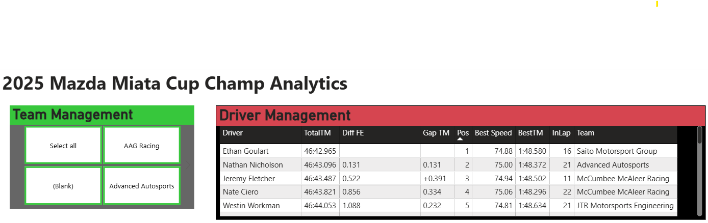
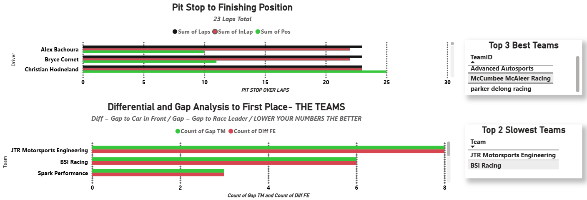

# Power-Bi

## Objective 

The transformation project aimed to establish how public data can be transported into a stimulating understanding of where to improve. The primary focus was to ingest data and generated symmetry and real-word solutions to improving lap patterns. This hands-on experience was designed to deepen simplicity with defensive thinking for all teams in the Michelin Race. 

### Tools Used 

- Excel 
- PowerBi 
- Site extraction.<a href="#fn1">1</a>

## Steps 
 ### Main Frame 
 #### Ref 1 : Team Diagram 

**My Insight:** As an aspiring race track owner, I'd like to let my clients interacte with the data. Instead of giving a paper print out in tables templates I will let you click around. Push and Play. 
--

### Lap Data 
#### Ref 2: Compartive Results 

**My Insight:** We can see being in a Team is different than placing first. This is a team effort as it is analytic timing with every opponent. 
--
Footnotes

1 Mazda MX-5 Cup , 2025 Chamionship Latest Results,” https://www.mx-5cup.com/results/2025-championship   

